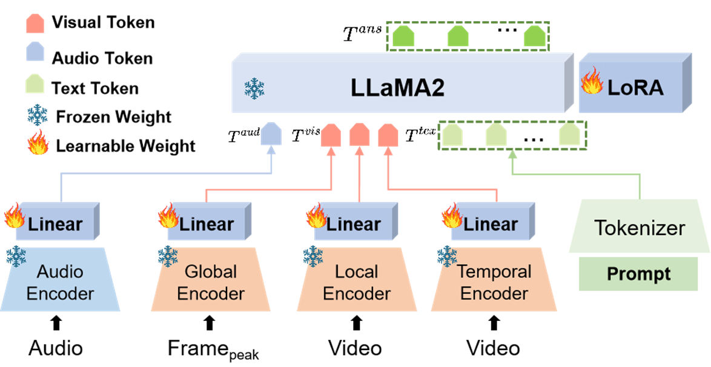
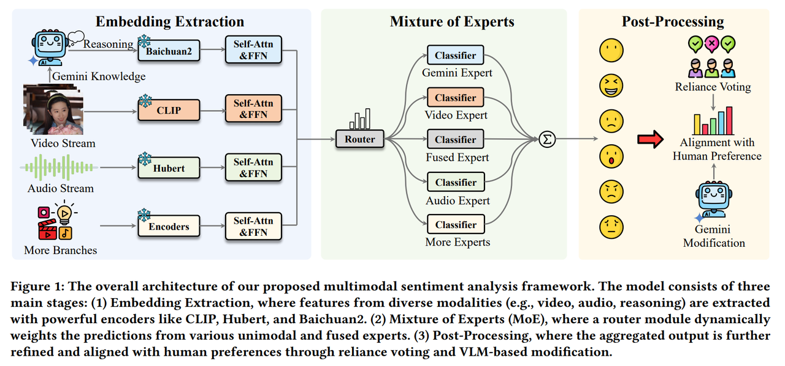
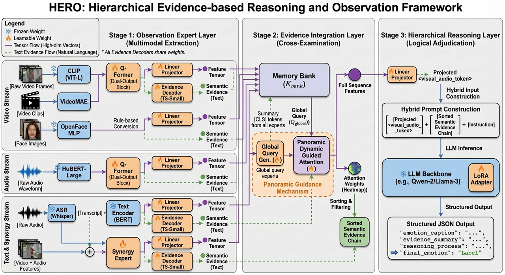

# 1. 项目概述

## 1.1 **项目名称**

**HERO: 面向多模态情感理解的分层式证据推理与观察框架 (Hierarchical Evidence-based Reasoning and Observation for Multimodal Emotion Understanding)**

* **命名解析:**

  * **Hierarchical (分层式):** 体现了我们从底层特征到高层语义证据，再到最终逻辑推理的层次化处理思想。

  * **Evidence-based (基于证据):** 强调了本框架的核心创新——所有结论都必须基于明确、可追溯的证据，旨在解决LLM的“幻觉”问题。

  * **Reasoning (推理):** 表明我们的目标超越了简单的分类，致力于实现更高级的认知任务。

  * **Observation (观察):** 突出了框架前端专家模块如同人类感官一样，对多模态信号进行细致“观察”的拟人化概念。

  * **HERO:** 缩写词本身响亮、易记，并带有一种“英雄模型”的寓意，旨在解决当前领域的重大挑战。

## 1.2 **研究背景与动机**

当前多模态情感识别领域呈现出两大主流范式：

**其一**是以传统融合模型（如MoE）为代表的高性能“黑箱”，它们在分类任务上表现优异，但其决策过程不透明，限制了模型的可信度与应用场景，此外，传统的模态融合方法（例如concat或者cross-attention），倾向于平等对待视、听、文三个模态。然而，研究表明在情感任务中，音频（语调/韵律）往往比视觉（表情）更具鲁棒性，平均的权重会导致噪声模态（如模糊的画面）干扰判断。；

**其二**是以端到端大型多模态语言模型（MLLM）为代表的可解释范式，它们能生成自然语言解释，但常受困于“幻觉”问题（解释与决策逻辑脱节），且整体架构庞大、灵活性差，尤其在面对真实世界中普遍存在的**模态数据缺失**时表现脆弱，也难以理解细微或者不常见的讽刺、苦笑等可能存在模态信息冲突的情况。这种性能与可解释性、理论与现实之间的鸿沟，构成了本研究的核心挑战。

## 1.3 **项目愿景与核心研究问题**

本项目旨在开创一种全新的多模态理解范式，通过构建**HERO**框架，系统性地回答以下核心研究问题：

> *我们能否设计一个统一的框架，它既能像领域专家一样对多模态信号进行**细粒度观察 (Observation)**，又能像逻辑学家一样进行**分层式、有据可循的推理 (Hierarchical, Evidence-based Reasoning)**，同时还能在信息不完整的现实场景下保持**鲁棒性**，最终实现高性能、高可信度、高灵活性的情感理解？*

## 1.4 **核心理念：从“黑箱融合”到“透明的、可质证的证据链”**

HERO框架的核心思想是模拟一个严谨的**科学探究或司法调查过程**。系统中的每个模块职责分明，共同构建一条清晰、透明且可被审视的证据链，彻底摒弃不透明的“黑箱”融合，确保最终的结论是在坚实的证据基础上通过逻辑推理得出的。

我们将这一理念解构为三个互为支撑的阶段，构成了本项目的核心贡献：

### 第一阶段：多维取证 —— "不仅要看懂，还要量化"

（Observation: From Qualitative to Quantitative）

在传统模型中，特征提取往往是模糊的（如一个高维向量）。HERO 创新性地引入了 “软硬结合”的取证机制：

* 硬证据（Hard Evidence - 生理指标）：引入 Action Unit (AU) 专家，类似于法医鉴定，直接量化面部肌肉运动（如“眉间收缩强度 0.8”）。这为情感判断提供了不可辩驳的生理基准，有效抑制了 LLM 的幻觉。

* 软线索（Soft Clues - 语义环境）：利用 CLIP 和 HuBERT 提取环境氛围与语调色彩，类似于现场勘查，提供情感发生的背景（Context）。

* 主要贡献：提出了 混合观测专家组 (MoE) 架构，实现了从单一语义特征向“生理+语义+时序”复合特征的跨越。

### 第二阶段：交叉质证 —— "听觉锚定与矛盾发现"

（Integration: Audio-Guided Cross-Examination）

证据往往是杂乱甚至冲突的（例如：一个人笑着说狠话）。HERO 摒弃了传统的“平均加权”，采用了带有偏置的交叉验证策略：

* 听觉锚定（Audio Anchoring）：基于 *Audio-Guided Fusion* 理论，我们认为声音包含了最真实的情绪泄露。系统以音频特征为“锚点” (Query)，去检索视觉画面中的佐证。这就像在审讯中，通过声音的颤抖来质疑表面的平静表情。

* 矛盾检测（Conflict Detection）：协同专家 (Synergy Expert) 专门负责“测谎”，通过比对音画的时序对齐性，敏锐捕捉“反讽”、“苦笑”等音画不一致的高级情感。

* 主要贡献：设计了音频引导注意力 (Audio-Guided Attention) 与 音画协同感知模块，解决了多模态冲突下的情感消歧难题。

### 第三阶段：逻辑裁决 —— "拒绝黑盒，给出理由"

（Reasoning: Transparent Adjudication）

最终的输出不应仅仅是一个标签，而是一份判决书。

* 结构化思维链（Structured CoT）：我们强制 LLM 遵循 `[列举证据] -> [分析冲突] -> [排除干扰] -> [得出结论]` 的推理路径。模型必须先承认“看到了皱眉”、“听到了低沉语调”，才能推导出“悲伤”的结论。

* 主要贡献：建立了一套 可解释的情感推理范式，使得模型的每一个预测都可以追溯到具体的视觉帧或音频片段，极大地增强了系统的可信度与落地潜力。

主要参考MER2024和MER2025的论文。

***

# 2. HERO 系统架构与模块详述

HERO由三大核心支柱模块构成，形成一条“**观察 → 整合 → 推理**”的层次化信息处理流。

## 2.1 **支柱一：观测专家层 (Observation Expert Layer)**

* **职责:**

  * 作为系统的“感官”和“初级分析员”， 采用 MoE (Mixture of Experts)思想，每个专家负责一个独立的模态（视觉、音频、文本转录、融合）。

  * 对输入信号进行深度分析，并行输出两种核心信息：用于精确数值计算的**低层特征张量 (Low-level Feature Tensor)**，和用于高层逻辑推理的**高层语义证据 (High-level Semantic Evidence)**。

* **核心技术与实现:**

  1. **双输出专家结构:** 每个专家均采用 `领域编码器 (Domain Encoder) + Q-Former` 的先进结构。

     * **领域编码器:** 选用SOTA预训练模型（视觉: `CLIP ViT-L/14`；音频: `HuBERT-Large`；文本: `BERT-base`）。

     * **Q-Former (借鉴BLIP-2/SECap):** 作为核心的“信息转换器”，将编码器输出的变长、高维特征序列，通过可学习的查询向量 (Learnable Queries) 高效地压缩并转换为固定长度、与LLM语义空间对齐的特征张量。此处的**Q-Former可能需要每个模态单独使用。**

     * **并行输出头:**

       * Head 1: 特征投影头 (Projection Head): 一个简单的 Linear Layer，将 Q-Former 输出映射到 LLM 的 Embedding 维度 (如 4096维)。输出 `Feature Tensor`。

       * Head 2: 证据解码头 (Evidence Decoder): 一个轻量级的生成模型 (如 T5-Small 或 2-layer Transformer Decoder)。它的任务是“翻译”——将特征翻译成自然语言描述。输出 `Semantic Evidence`。注意，此处的Evidence Decoder可以是不同模态共用的，在输入前加一个 Task Token (如 `<visual_task>`, `<audio_task>`) 区分即可。这将大大减少显存占用。

  2. **专家训练的“净化”与“对齐”策略:**

     * **证据净化 (Disentanglement)**

       * 手段 I (STMIL)：引入**互信息学习损失 (STMIL，基于vCLUB的互信息上界估计)**，通过最小化情感线索与内容信息（如语音中的文字、视频中的身份）之间的相关性，确保专家提取的证据更纯粹、更聚焦于情感本身。

       * 手段 II (对抗训练 - 备选)：可以考虑**对抗性训练 (Adversarial Training)**。即引入一个判别器，它努力区分一个特征是来自于哪个说话人/身份，而专家编码器则努力生成让判别器无法区分的特征。

     * **证据对齐 (Alignment):** 引入**对比学习损失 (SCCL)**，在表示空间中强制拉近专家输出的特征张量与对应的人工标注“黄金”文本证据，确保特征的语义与其宣称的证据内容高度一致。

* 具体专家配置

# 整理好的标准markdown表格（完整保留所有公式、符号、维度、标注，可直接复制使用）
| 一级专家组分类          | 核心专家名称                          | 模型 / 工具选型                                                                 | 输入数据规格                     | 核心作用                                                                                                                                                                                                 | 输出特征（含维度）|
| ----------------------- | ------------------------------------- | ------------------------------------------------------------------------------ | -------------------------------- | -------------------------------------------------------------------------------------------------------------------------------------------------------------------------------------------------------- | ---------------------------------------------------------------------------------------------------------------------------------------------------------------- |
| 视觉专家组Visual Expert | 全局语境专家(Spatial/Context Expert)  | CLIP (ViT-L/14)，加载 OpenAI 预训练权重                                        | 稀疏采样视频帧（每秒 1 帧）| 提取静态场景信息，为情感分析提供环境背景（Context），如「医院走廊」「生日派对」| 视觉语义 Token 序列 $\boldsymbol{T_{vis\_global}}$  维度：$\boldsymbol{N \times 1024}$ |
| 视觉专家组Visual Expert | 时序动态专家(Temporal/Motion Expert)  | VideoMAE v2 (ViT-Base)                                                         | 16 帧连续采样的视频小片段 (Clip)  | 捕捉人物动态行为特征，弥补 CLIP 对动作不敏感的缺陷，如「突然站起」「挥手」「捶胸顿足」| 动作特征 Token 序列 $\boldsymbol{T_{vis\_motion}}$  维度：$\boldsymbol{M \times 768}$ |
| 视觉专家组Visual Expert | 生理行为专家(Physiological/AU Expert) | OpenFace 2.0 / MediaPipe + 轻量级 MLP（Linear → ReLU → Linear）| 视频单帧图像                     | 提取不可辩驳的生理硬证据，重点关注 AU4 (皱眉)、AU12 (嘴角上扬)、AU15 (嘴角下垂)、AU1/AU2 (眉毛上扬)；将原始 AU 特征映射至统一维度，为 LLM 推理提供可靠依据 | 生理特征 Token 序列 $\boldsymbol{T_{AU}}$  处理逻辑：35 维 AU 数值向量 → 映射至 768 维 |
| 音频专家组Audio Expert  | 声学情感专家(Acoustic Expert)         | HuBERT-Large（中 / 英文优化版）（取 Transformer 最后三层特征均值）| 原始音频流                       | 捕捉语调、重音、停顿、哭腔等非语言 (Paralinguistic) 声学信号，挖掘语音中的情感韵律信息| 音频情感 Token 序列 $\boldsymbol{T_{audio}}$ |
| 文本专家组Text Expert   | ASR 转录专家                          | Whisper-large-v3 / Qwen-Audio                                                  | 原始音频流                       | 高精度语音转文字，通过 prompt 指令保留「[laughter]、[sigh]」等副语言标签，完整还原语音语义内容| 带副语言标签的文本 Token 序列 |
| 协同专家组Synergy Expert | 多模态协同专家(Audio-Visual Synchrony Expert) | 2 层 Cross-Modal Transformer                                                   | 时序对齐后的 $T_{vis\_motion} + T_{audio}$ | HERO v2.1 核心升级模块，解决「反讽 / 音画非同步」问题； ✅ 特征时间轴强制对齐（插值 / Pooling） ✅ 音频 - 视频帧点对点交互融合 ✅ 前置代理任务：判断「声音是否归属对应视频」（二分类） | 协同特征 Token $\boldsymbol{T_{synergy}}$  无具体语义，仅表征「音画匹配 / 冲突」核心信号 |

* **输入/输出详述:**

  * **输入:** 单一模TAI的原始数据流（视频帧序列, 音频波形, 文本字符串）。

  * **输出 (并行):**

    * `Feature_Tensor_i`: `[Batch Size, Num_Queries, Dim]`，如 `[B, 32, 768]`。

    * `Semantic_Evidence_i`: `string`，如 "视觉证据 (VE-01): 观察到人物面部出现微笑表情 (AU12)。"

## 2.2 **支柱二：证据整合层 (Evidence Integration Layer)**

* **职责:**

  * 作为系统的“首席调查员”或“法官”，负责接收所有专家的证据，并进行智能化的评估、筛选、融合与补全。

  * 确保提交给最终推理层的是一份结构完整、重点突出、且经过交叉验证的“案件卷宗”。

  * 本层不再预设单一模态为主导，而是采用 “全景引导 (Panoramic Guidance)” 机制——即先通过轻量级交互生成一个包含全模态信息的全局查询向量，再以此为锚点去精细检索各专家的细节。它借鉴 *Audio-Guided Fusion* 的核心思想——“用强特征引导弱特征”，但将“强特征”的定义权交给了设计好的注意力机制，而不是使用平均的权重或者完全不进行设置。

* **核心技术与实现:**

  1. **全景动态引导注意力 (Panoramic Dynamic Guided Attention)**

  为了生成一个比固定使用 $$T_{audio}$$ 或局部 $$T_{synergy}$$ 更合理、更鲁棒的 Query，我们实现了 **自适应查询生成器 (`AdaptiveQueryGenerator`)**，支持三种策略：

  *   **`dynamic` (默认/推荐)**: **动态锚定 (Dynamic Anchoring)**。
      1.  **门控打分 (Gated Scoring)**: 使用一个轻量级 MLP (`Linear -> Tanh -> Linear`) 对每个模态的 Summary 向量计算置信度分数。
      2.  **Mask 处理**: 在 Softmax 之前，将缺失模态的分数填充为 `-inf`，确保其权重为 0。
      3.  **Hybrid Anchor 生成**: 通过加权求和生成混合锚点向量。
      4.  **Self-Attention Refinement**: 混合锚点作为 Query，参与一次 Self-Attention (Q=Anchor, K=V=Summaries)，进行上下文微调，最终输出 $$Q_{global}$$。
      *   *优势*: 模型自动学习哪种模态在当前场景下最可靠，无需人工预设。

  *   **`audio` (传统/对照)**: **音频锚定 (Audio Anchoring)**。
      *   强制选取 Audio 对应的向量作为 Query，Cross-Attend 所有其他模态。
      *   *适用场景*: 当已知音频总是最可靠的情感线索时（如无遮挡的语音通话）。

  *   **`concat` (基线)**: **直接拼接 (Concatenation Baseline)**。
      *   将所有模态的 Summary 在特征维度拼接，通过 MLP 映射回 `hidden_dim`。
      *   *适用场景*: 作为消融实验的对照组，验证注意力机制的增益。

  > **实现代码**: `minigpt4/models/hero/integration_layer.py` 中的 `AdaptiveQueryGenerator` 类。

  2. **模态缺失下的双轨鲁棒性机制:**

    * **训练时 - 隐式表征对齐 (Implicit Representation Alignment):** 引入一个并行的“多模态融合专家”**作为“教师模型”。在训练中通过**模态丢弃 (Modality Dropout) 随机模拟信息不全的场景，并增加一个**KL散度损失** `L_KL = KL(P_teacher || Q_student)`，强迫模型在输入不全时，也要在特征空间中“脑补”出与“教师”看到全部信息时尽可能相似的表示。

    * **推理时 - 显式证据补全 (Explicit Evidence Imputation):** 当检测到模态缺失时，一个轻量级的**证据补全模块**（如小型Transformer解码器）会基于所有可用的`Semantic_Evidence_i`，生成对缺失证据的合理推断文本，并明确标记来源，如`[推断的音频证据 (IAE-01): 根据正面视觉和文本内容，推断语音语调可能上扬]`。

* **输入/输出详述:**

  * 输入 (Inputs)

    本层接收来自第一层 MoE 所有专家的输出，分为 高层概览 (Summary) 和 细节特征 (Details) 两类：

    1. 用于生成 Query 的高层概览集合 ($$S_{summary}$$):

       * 来自各专家的 `[CLS]` Token 或 Global Average Pooling 向量。

       * 包含：

         * $$v_{vis_global}$$ (CLIP)

         * $$v_{vis_motion}$$ (VideoMAE)

         * $$v_{vis_au}$$ (OpenFace MLP)

         * $$v_{audio}$$ (HuBERT)

         * $$v_{text}$$ (Text Encoder)

         * $$v_{synergy}$$ (Synergy Expert, 关键的反讽/同步性指示器)

       * *维度*: 每个向量均为 `[Batch Size, 1, Dim]` (例如 Dim=768 或 4096)。

    2. 用于构建 K-Bank 的细节特征集合 ($$S_{details}$$):

       * 来自各单模态专家的完整特征序列。

       * 包含：

         * $$T_{vis\_global}$$ (CLIP, 序列长度 $$L_{v1}$$)

         * $$T_{vis\_motion}$$ (VideoMAE, 序列长度 $$L_{v2}$$)

         * $$T_{AU}$$ (OpenFace, 序列长度 $$L_{au}$$)

         * $$T_{audio}$$ (HuBERT, 序列长度 $$L_{a}$$)

         * $$T_{text}$$ (Text Encoder, 序列长度 $$L_{t}$$)

       * 注意: $$T_{synergy}$$ 不包含在此集合中。

       * *维度*: `[Batch Size, Sequence_Length_i, Dim]`。

  * 输出 (Outputs)

    本层经过全景引导注意力计算后，输出两部分信息，分别供给 LLM 的 Embedding Space (隐层) 和 Prompt Context (文本层)：

    1. 整合特征张量 (`Integrated_Context_Tensor`):

       * 描述: 这是经过 $$Q_{global}$$ 筛选、加权并融合后的高浓缩特征表示。它包含了当前样本中最具情感辨识度的视觉、音频和文本细节。

       * 用途: 作为 Soft Prompt 插入到 LLM 的 Embedding 序列中，直接参与数学运算。

       * 形状: `[Batch Size, Num_Queries, Dim]` (通常 `Num_Queries` 设为 32 或 64, `Dim` 对齐 LLM 维度如 4096)。

    2. 动态注意力权重 (`Dynamic_Attention_Weights`):

       * 描述: 这是一个标量向量或热力图，记录了 $$Q_{global}$$ 对 $$K_{bank}$$ 中不同模态区域的关注程度。

       * 用途:

         * 可解释性: 用于可视化，告诉用户“模型主要看了哪里”。

         * Prompt 增强: 用于对 Semantic Evidence 进行排序。例如，如果 `Weights[Audio]` 很高，系统会自动将音频证据的文本描述排在 Prompt 的最前面，提示 LLM “请重点关注声音”。

       * 形状: `[Batch Size, Total_Sequence_Length_of_K_Bank]`。

## 2.3 **支柱三：分层推理层 (Hierarchical Reasoning Layer)**

* **职责:**

  本层作为系统的“最终决策者”，基于整合后的多模态特征与文本证据，生成一份包含情感描述 (Captioning)、逻辑推理与最终判决的结构化报告。

  这里总结来说，专家负责“描述现象”，LLM 负责“推导结论”

  必须强调的是，第一层专家输出的 `Semantic Evidence` 并非最终的情感判决，而是对客观现象的原子化描述（如“眉毛上扬”、“音量增大”）。这些描述本身可能是片面甚至存在噪声的。

  HERO 框架的核心价值在于第三层 LLM 的全局消歧能力：它不仅能综合多模态的原子证据发现深层逻辑（如“笑面虎”式的反讽），还能利用直接注入的 Feature Tensor 对潜在的错误文本描述进行校准。因此，专家层的“准”是物理层面的准（看清动作），而 HERO 的“准”是逻辑层面的准（读懂人心）。

* **核心技术与实现:**

  1. **混合式输入嵌入 (Hybrid Input Embedding):**&#x20;

     为了打通感知与认知的界限，我们构建了一个混合模态的输入序列：

     1. 特征投影与注入: 使用一个简单的 Linear Projector 将上一层输出的 `Integrated_Context_Tensor` 映射到 LLM 的词嵌入维度。这些向量被作为特殊的 `<visual_audio_token>` 插到 Prompt 的开头。

     2. 文本序列拼接: 将 `Final_Evidence_Brief` (即经过注意力权重排序的第一层语义证据集合 $$S_{evidence}$$) 通过 Tokenizer 转换后，拼接在特征 Token 之后。

        * 效果: LLM 看到的输入既包含“直觉信号”(Tensor)，也包含“逻辑线索”(Text)。

  2. **结构化指令微调 (Structured Instruction Tuning):** 我们预计选用 Qwen-2-7B-Instruct 或 Llama-3-8B-Instruct 作为基座，通过指令微调 (Instruction Tuning) 训练其遵循扩展版的 JSON 输出规范。特别地，我们引入了 Emotion Captioning 任务。

     输出字段定义:

     1. `emotion_caption` (情感描述): 一句通顺的自然语言，描述当前场景中人物的情感状态和行为（例如：“一名中年男子面带愠色，语速急促地指责对方”）。这不仅是输出，更是辅助推理的隐式思维链。

     2. `evidence_summary` (关键证据): 罗列支撑判断的最显著特征（如：“高音量”、“皱眉”）。

     3. `reasoning_process` (推理逻辑): 简述为什么这些证据指向该情感，并提及是否存在音画冲突。

     4. `final_emotion` (最终类别): 标准的情感标签。

* **输入/输出详述:**

  * **输入:** 输入: 混合嵌入序列 (Projected Tensor + Text Tokens)。

  * **输出:** 一段结构化的JSON文本，示例如下：

***

# 3. 训练、评估与实现

## 3.1 **训练策略：两阶段渐进式学习**

鉴于 MER 任务中高质量推理数据稀缺而无标签数据丰富的现状，HERO v2.1 摒弃了传统的端到端一次性训练，转而采用 “从感知到认知，从无监督到全监督” 的三阶段渐进式策略。

### 阶段一：模态解纠缠与表征对齐 (Stage 1: Disentanglement & Alignment)

目标: 训练 MoE 专家层 和 Q-Former，使其具备“提纯情感特征”和“多模态语义对齐”的能力。此阶段不涉及 LLM 推理，重点在于打好特征基础。

* 数据: 大规模无标签或弱标签多模态数据 (LaION-Subset, WavCaps, MER-SEMI)。

* 组件状态:

  * 训练: Q-Former, Synergy Expert (Layer 1), Projector。

  * 冻结: 所有 Encoders (CLIP, HuBERT 等), LLM Backbone。

* 核心损失函数组合:

$$\mathcal{L}_{Stage1}=\mathcal{L}_{ITC}+λ_1\mathcal{L}_{STMIL}+λ_2\mathcal{L}_{Synergy}$$

1. $$\mathcal{L}_{ITC}$$ (Image/Audio-Text Contrastive Loss): 基础的跨模态对齐损失，拉近视觉/音频特征与对应文本描述的距离。

2. $$\mathcal{L}_{STMIL}$$ (Speech-Text Mutual Information Learning) —— \[特征净化]:

   * 基于 vCLUB 的互信息上界最小化。

   * 目的: 强迫 Audio Expert 剥离与 ASR 内容（语义）相关的信息，仅保留语调、韵律等情感特征。

3. $$\mathcal{L}_{Synergy}$$ (Synergy Pre-training Loss):

   * 构建正负样本对（正：原视频；负：音画错位视频），训练 Synergy Expert 进行二分类判别。

   * 目的: 赋予模型基础的音画同步性感知能力。

### 阶段二：生成式情感预训练与伪标签增强 (Stage 2: Generative Pre-training with Pseudo-Labeling，在有监督数据不足时启用)

目标: 激活 LLM 的情感描述能力 (Captioning)，并通过半监督学习扩充数据规模。

* 数据: MERR (部分有标签) + 共识伪标签扩充数据。

* 共识伪标签策略 (Consensus Pseudo-Labeling):

  * 利用 Stage 1 获得的初步模型对 MER-SEMI 无标签数据进行预测。

  * 引入外部强模型（如 Gemini Pro Vision / GPT-4o）对同批数据进行 Zero-shot 标注。

  * 过滤机制: 仅保留两者预测一致且置信度 $$>0.9$$ 的样本，作为“银标准数据”加入训练集。

* 组件状态:

  * 训练: Q-Former, Projector, LLM LoRA Adapter。

  * 冻结: Encoders。

* 核心损失函数组合:

$$\mathcal{L}_{Stage2}=\mathcal{L}_{Gen}+λ_3\mathcal{L}_{SCCL}+λ_4\mathcal{L}_{KL}$$

1. $$\mathcal{L}_{Gen}$$ (Caption Generation Loss): 标准的自回归语言模型损失，训练 LLM 生成如“一个愤怒的男人在吼叫”的情感描述。

2. $$\mathcal{L}_{SCCL}$$ (Speech-Caption Contrastive Loss): 进一步拉近 Feature Tensor 与生成的 Caption 文本在语义空间的距离。

3. $$\mathcal{L}_{KL}$$ (Robustness Loss): 针对 2.2 节提到的 Teacher-Student 架构，通过 Modality Dropout 训练模态缺失下的特征重构能力。

### 阶段三：全监督指令微调 (Stage 3: Supervised Instruction Tuning)

目标: 最终强化模型的逻辑推理能力，使其学会遵循 JSON 格式并处理反讽等复杂样本。

* 数据: MERR (高质量人工标注推理文本) + MER2024/2025 竞赛数据 + 反事实构造样本。

* 组件状态: 全量微调 (Projector, LoRA, Q-Former)。

* 核心任务:

  * 结构化 CoT 推理: 输入混合 Prompt，强制输出包含 `emotion_caption`, `evidence_summary`, `rationale`, `final_emotion` 的 JSON。

  * 反事实样本攻关: 专门训练模型识别音画冲突样本（如“笑脸+哭声”），在此类样本上施加更高的 Loss 权重。

* 损失函数:

$$\mathcal{L}_{Stage3}=\mathcal{L}_{Struct\_Gen}$$

直接优化生成结构化 JSON 文本的交叉熵损失。

## 3.2 **损失函数**

HERO v2.1 在不同阶段采用了特定的损失函数组合，以实现从特征解纠缠到语义对齐的逐步优化。

### 3.2.1 基础对齐损失 (Stage 1 & 2)

1. ITC (Image/Audio-Text Contrastive Loss):

   * 定义: 经典的对比学习损失。

   * 公式: 对于一个 Batch 中的 $$N$$ 个音/视频-文本对 $${(v_i, t_i)}_{i=1}^N$$，最大化正样本对的相似度，最小化负样本对的相似度。

   $$\mathcal{L}_{nc} = -\frac{1}{2N} \sum_{i=1}^{N} \left( \log \frac{e^{\text{sim}(v_i,t_i)/\tau}}{\sum_j e^{\text{sim}(v_i,t_j)/\tau}} + \log \frac{e^{\text{sim}(v_i,t_i)/\tau}}{\sum_j e^{\text{sim}(v_i,t_j)/\tau}} \right)$$

   * 作用: 让 Q-Former 学会基本的跨模态匹配。

2. SCCL (Speech-Caption Contrastive Loss):

   * 定义: 在 Stage 2 中，强制让生成的 Caption 文本 ($t\_{cap}$) 与底层的 Projector 输出特征 ($$z_{proj}$$) 保持一致。

   * 作用: 防止 LLM 生成与感知特征无关的“幻觉”描述。

### 3.2.2 特征净化损失 (Stage 1 关键)

1. STMIL (Speech-Text Mutual Information Learning):

   * 定义: 为了剥离非情感信息（如说话内容），我们最小化音频情感特征 ($$Z_{emo}$$) 与 ASR 文本特征 ($$Z_{content}$$) 之间的互信息互信息上界（vCLUB）。

   * 公式:

   $$\mathcal{L}_{\text{STML}} = \mathbb{E}\left[ \log q_{\theta}(Z_{\text{content}}|Z_{\text{emo}}) \right] - \mathbb{E}\left[ \log q_{\theta}(Z_{\text{content}}|Z_{\text{emo}}^{\text{shuffle}}) \right]$$

   * 作用: 迫使 $$Z_{emo}$$ 遗忘具体的单词内容，只保留语调和情绪。

### 3.2.3 鲁棒性与生成损失 (Stage 2 & 3)

1. $$\mathcal{L}_{KL}$$ (Modality Dropout Robustness Loss):

   * 定义: 衡量 Teacher (全模态) 与 Student (缺模态) 输出分布的差异。

   * 公式: $$\mathcal{L}_{KL} = D{KL}(P_{teacher}(y|V,A,T) || P_{student}(y|A,T))$$

   * 作用: 训练模型在模态缺失时的“脑补”能力。

2. $$\mathcal{L}_{Gen}$$ (Structure-Aware Generation Loss):

   * 定义: 针对 Stage 3 的 JSON 输出进行优化的交叉熵损失。我们给予 `rationale` 和 `final_emotion` 字段更高的 Token 权重。

   * 公式: $$\mathcal{L}_{Gen} = -\sum_{t} w_t \log P(y_t | y_{<t}, X)$$

## 3.3 **数据集**

*

### 3.3.1 数据集构成

* 基础集 (Base Set): MERR, MER2024/2025 官方训练集。

* 增强集 (Augmented Set):

  * MER-SEMI: 利用 Stage 2 的“共识伪标签”策略筛选出的高置信度样本（仅在数据不足时启用）。

  * LaION/WavCaps 子集: 仅用于 Stage 1 的特征对齐，不参与 Stage 3 微调。

  * MELD, IEMOCAP, DFEW等经典数据集：没有caption字段，可以考虑构造补充

### 3.3.2 关键增强技术：反事实样本构造 (Counterfactual Sample Generation)

这是提升模型抗干扰能力和反讽检测能力的杀手锏。

* 操作:

  1. 选取一个带有明显“快乐”标签的视频 $$V_{happy}$$。

  2. 选取一个带有明显“悲伤”标签的音频 $$A_{sad}$$。

  3. 将它们合成一个新的样本 $$(V_{happy}, A_{sad})$$。

  4. 人工/GPT-4 修正标注: 将标签修正为 "Sarcasm/Conflict" 或 "Masked Sadness"。

* 作用: 在 Stage 3 中混入 10%-15% 的此类样本，强迫模型在 CoT 推理时关注音画不一致现象。

### 3.3.3 类别平衡重采样

* 针对样本极少的类别（如 Fear, Disgust），采用 Class-Aware Sampler，确保每个 Epoch 中各类别样本数量大致相等。

## 3.4 **评估指标**

### 3.4.1 核心性能指标 (Performance Metrics)

针对 MER 竞赛和分类任务的标准指标：

1. 加权平均 F1 值 (Weighted Average F1-score, WAF):

   * 定义: 考虑到情感类别的不平衡（如“恐惧”样本少），WAF 是比 Accuracy 更公正的核心指标。

   * *目标*: 在 MER-TEST 上达到 Top-Tier 水平（>0.85）。

2. 准确率 (Accuracy)，混淆矩阵等

### 3.4.2 鲁棒性指标 (Robustness Metrics)

验证模型在模态缺失或噪声环境下的稳定性（针对 Modality Dropout 和 Synergy 设计）：

1. 噪声鲁棒性下降率 (Noise Robustness Drop Rate):

   * 测试模型在完整模态下的 F1 与在单模态缺失（如只有音频）下的 F1 之差。

   * *目标*: 下降率 $$< 10%$$（传统模型通常 $$> 20%$$）。

2. 反讽检测准确率 (Sarcasm Detection Accuracy):

   * 在专门构建的“反事实样本集”或反讽子集上的分类准确率。

### 3.4.3 生成质量与可解释性指标 (Generation & Explainability Metrics)

针对 LLM 生成的 JSON 报告进行评估：

1. Caption 质量 (CIDEr / SPICE):

   * 衡量生成的 `emotion_caption` 与人工描述的语义一致性。

   * BLEU, ROUGE, METEOR, 以及基于Sentence-BERT的语义相似度。

2. 推理逻辑一致性 (Reasoning Consistency Score):

   * 人工抽检: 随机抽取 100 个样本，人工评分 `evidence_summary` 和 `final_emotion` 之间的逻辑连贯性（1-5分）。目标为平均分 $$> 4.5$$。

   * 采用**LLM-as-a-Judge**策略，设计精巧的Prompt让GPT-4o评估生成推理是否完全基于给定证据，以及逻辑是否连贯。

## 3.5 **技术实现路径 (Codebase Strategy)**

我们采用 “继承与重构 (Inherit & Refactor)” 的工程策略，基于 *Emotion-LLaMA* 开源仓库进行二次开发，以最小化工程风险。

#### 阶段一：基线复现与框架剥离 (Phase 1: Baseline & Skeleton) - \[Week 1-3]

* 核心动作:

  1. Clone & Run: 拉取 *Emotion-LLaMA* 代码，配置环境，跑通原版模型在 MERR 数据集上的 Training 和 Eval 流程。确保数据加载器 (Data Loader) 和 评测脚本 (Metrics) 工作正常。

  2. 基座替换 (Surgery): 修改 `model.py`，将默认的 LLaMA Backbone 替换为 Qwen-2-7B-Instruct。调试 Input/Output 维度，确保模型能跑通简单的 Text-only 训练。

  3. AU 数据流并入: 修改 `dataset.py`，在加载视频的同时，读取预处理好的 OpenFace AU 特征文件，并将其作为新的 Key 放入 Batch 中。

#### 阶段二：MoE 与融合模块嵌入 (Phase 2: MoE Injection) - \[Week 4-6]

* 核心动作:

  1. 特征提取器扩展: 在 `modeling_hero.py` (新建文件) 中，重写 `encode_multimodal` 方法。除了原有的 Visual Encoder，并行加入 `HuBERT` 和 `OpenFace_MLP`。

  2. 中间层植入: 实现 2.2 节定义的 `IntegrationLayer` (包含 Q-Former 和 Panoramic-Guided Attention)，插入到 Encoder 和 LLM 之间。

  3. Stage 1 训练: 冻结 LLM，仅利用 Stage 1 的 Loss (ITC, STMIL) 训练这个新插入的中间层。

#### 阶段三：系统微调 (Phase 3: System Tuning) - \[Week 7-10]

* 核心动作:

  1. Stage 2/3 Pipeline: 复用 *Emotion-LLaMA* 的 `Trainer`，但修改 `compute_loss` 函数，加入我们设计的 $$\mathcal{L}_{Gen}$$ &#x548C;*&#x20;*$$\mathcal{L}_{KL}$$。

  2. Prompt 改造: 修改 Input Formatting 逻辑，适配 HERO 的 Hybrid Prompt 结构（插入 Tensor 和 文本证据）。

#### 阶段四：评估与冲榜 (Phase 4: Evaluation) - \[Week 11-12]

* 核心动作:

  1. 直接使用 *Emotion-LLaMA* 现成的评测脚本计算 F1 和 Accuracy。

  2. 新增脚本计算 LLM-as-a-Judge 和 鲁棒性指标。

# Q\&A

## 如果第一层的文本证据不准确，在第三层拼接后输入LLM，按理说就会对结果造成很大的误导。但是如果第一层的文本证据准确的话，我们的项目就没有意义了，因为可以直接在第一层进行输出。怎么解释这个问题？

这个问题的核心在于：Expert 看到的只是“局部事实 (Local Fact)”，而 LLM 做的是“全局推理 (Global Reasoning)”。

我们可以从以下三个维度来解释 “为什么即使专家不完美，HERO 依然有巨大意义”，这也是我们项目的核心价值所在：

***

1. 局部准确 vs. 全局误判 (Local Accuracy vs. Global Context)

   * 专家只能看局部:

     * 视觉专家看到“嘴角上扬”，输出文本：“他在笑”。（这是准确的局部事实）

     * 音频专家听到“语调低沉”，输出文本：“声音低沉”。（这也是准确的局部事实）

   * 单看专家是不够的:

     * 如果你只信视觉专家，你会判“高兴”。

     * 如果你只信音频专家，你会判“悲伤”。

   * LLM 的价值 (消歧):

     * LLM 看到这两条看似矛盾的文本，结合 Tensor 中的微表情特征，推理出：“这是一次苦笑（Masked Smile）”。

     * 解释: 专家的文本证据通常是描述性的（Descriptive），而不是结论性的（Conclusive）。专家的任务是\*\*“忠实记录现象”，LLM 的任务是“透过现象看本质”\*\*。

2. 软硬互补纠错 (Soft-Hard Complementarity)

   * 专家文本确实可能出错:

     * 比如 ASR 听错了字，或者 Caption 把“男人”看成了“女人”。

   * Tensor 的救场作用:

     * 这就是为什么我们要用 Hybrid Input (混合输入)！

     * LLM 同时接收 文本证据 和 特征 Tensor。

     * 如果文本说“他在哭”，但 Tensor 里包含强烈的“大笑”信号（这是 LLM 在预训练中学到的模式），LLM 有能力忽略错误的文本提示，信赖 Tensor 信号。

     * 解释: 文本证据更多是作为一种 CoT 的引导线索 (Hint)，而不是绝对真理。Tensor 才是底层的硬通货。

3. 处理复杂的逻辑关系 (Complex Logic Handling)

   * 专家无法处理反讽/双关:

     * 文本专家转录出：“你真棒”。

     * 音频专家识别出：“语调平平”。

     * 单一专家都认为这是好话。

     * 只有 LLM 结合上下文（Context）和常识（Common Sense），才能推理出：“在对方犯错的情境下说‘你真棒’，其实是讽刺。”

     * 解释: 这种高阶认知推理是底层专家模型（如 CLIP, HuBERT）完全不具备的能力，只有 LLM 能做。

## 第一层用了 CLIP (ViT-L), VideoMAE (ViT-B), HuBERT (Large), 还要跑 OpenFace 和 Synergy Transformer，最后还要跑一个 7B 的 LLM。作为一个情感识别系统，这样的推理延迟（Latency）能落地吗？显存扛得住吗？"

* 回应逻辑：区分“离线分析”与“实时交互”，并强调复用性。

* 具体：

  1. 场景定位：HERO 针对的是 高精度心理分析/庭审/医疗诊断 场景，而非手机端的实时娱乐应用。准确率和可解释性优于实时性。实际训练时，特征也是离线提取的。

  2. 特征提取并行化：第一层的 MoE 是完全并行的，工程上可以流水线处理。

  3. 参数冻结：所有的 Encoder (CLIP, HuBERT等) 都是冻结的（Frozen），只推理不反向传播，显存占用其实可控。

  4. 轻量化替代 (备选)：如果必须提速，我们可以用 MobileNet 或 Tiny-ViT 替换 CLIP，用 DistilHuBERT 替换 Large 版本，这属于“模型压缩”范畴，不影响架构本身的先进性。

## 2.3 节把 Tensor 通过一个简单的 Linear Projector 投影后就直接丢给 LLM 了。但是，LLM 的语义空间和 HuBERT/VideoMAE 的特征空间差异巨大。你凭什么保证 LLM 能读懂这些 Tensor？ 仅仅靠少量的情感数据微调，LLM 真的能学会'看'视频吗？

## MER (多模态情感) 的高质量标注数据通常很小（几千到一万条）。而你们的模型引入了 Synergy Expert、Q-Former、Projector 和 LoRA，可学习参数量也不小。在这么小的数据上训练这么复杂的架构，难道不会过拟合（Overfitting）吗？

## 你在 2.2 节极度依赖 $$Q_{global}$$ (包含 Synergy 信息) 来做 Query。但是，Synergy Expert 本身如果因为输入缺失（比如静音视频）而判断错了怎么办？ 用一个错误的 Query 去检索，岂不是一步错步步错？
